# TOON vs. JSON: An Experimental Evaluation of Serialization, Compression, Caching, and End-to-End HTTP Performance

**Aditya Narayan Barmola**\
Netaji Subhas University of Technology (NSUT), New Delhi, India\
Email: `adibarmola@gmail.com`

## Abstract

JSON is the dominant interchange format for web APIs, but repeated field
names and structural delimiters can make regular structured responses
substantially larger than necessary. TOON (Token-Oriented Object
Notation) uses a schema-oriented representation in which regular records
can be represented as compact rows.

This work presents a systems-level experimental evaluation of JSON and
TOON across the complete API serving path rather than comparing
serialized byte counts alone. The benchmark evaluates 100,000-record
flat and nested workloads under identity encoding and Brotli compression
levels 5, 9, and 11. It separately measures data retrieval,
serialization, compression, server processing, and end-to-end HTTP
latency, including p50 and p95 latency. The study also evaluates native
and cross-source generation and examines canonical and native
cache-serving behavior.

The results show that TOON reduces raw representation size by
approximately 58--62% for the evaluated workloads. In the flat native
identity configuration, a 59.98% raw-byte reduction corresponds to an
approximately 67.68% improvement in mean HTTP latency. The experiments
also expose an important trade-off: the current native C++ TOON
serializer incurs additional cost on nested workloads, while aggressive
Brotli compression can make the smaller TOON input computationally
advantageous. Cache experiments further show that compact
representations can provide substantial serving benefits once response
generation is materialized.

The benchmark therefore evaluates serialization format as one component
of a larger systems pipeline involving computation, compression,
caching, and transport.

**Keywords:** TOON, JSON, serialization, compression, Brotli, HTTP
latency, caching, benchmarking, API performance

------------------------------------------------------------------------

# 1. Introduction

JSON is widely used for web APIs because it is simple, interoperable,
human-readable, and supported across programming ecosystems. However,
regular JSON records repeatedly encode object keys and structural
delimiters.

TOON takes a schema-oriented approach to regular structured data.
Instead of repeating field names for every object, a schema can be
declared once and records can be represented as compact rows. For
example, the flat workload uses:

``` text
[100000]{id,name,age,city}:
1,QAHFTR,52,Mumbai
2,PACGPO,63,Bhopal
3,KLHWTE,45,Kolkata
```

The central question of this study is therefore not simply whether TOON
produces fewer bytes, but whether that compactness survives the complete
serving pipeline:

> When serialization, compression, server processing, caching, and HTTP
> delivery are considered together, does TOON's structural compactness
> produce a measurable end-to-end performance advantage over JSON?

A smaller representation does not automatically imply a faster
implementation. Serialization may become more expensive, compression may
behave differently, and server-side computation can dominate transport
savings. The benchmark is designed to measure these effects separately
and together.

# 2. Research Questions

The experiment addresses seven research questions.

### RQ1 --- Payload compactness

Does TOON reduce the number of bytes required to represent the same
100,000 logical records compared with JSON?

### RQ2 --- Post-compression compactness

After Brotli compression, how much of TOON's original byte advantage
remains?

The evaluated compression regimes are identity, Brotli 5, Brotli 9, and
Brotli 11.

### RQ3 --- Serialization cost

Does the native C++ TOON serializer require more or less time than JSON
serialization, and does this depend on whether the workload is flat or
nested?

### RQ4 --- Compression cost

Does TOON's smaller input reduce compression work sufficiently to offset
additional serialization cost?

### RQ5 --- End-to-end latency

When retrieval, serialization, compression, server-side overhead, and
HTTP delivery are considered together, does TOON reduce mean, p50, and
p95 latency?

### RQ6 --- Source robustness

Do the conclusions remain consistent when the requested output format is
generated from the opposite source representation?

### RQ7 --- Cache behavior

When responses are already materialized in a cache, does TOON's smaller
representation produce an additional serving advantage?

# 3. Hypotheses

The benchmark was designed around competing effects rather than assuming
that TOON must win every metric.

-   **H1 --- Spatial compactness:** TOON should substantially reduce raw
    payload size because repeated field names and structural syntax are
    represented once at the schema level.
-   **H2 --- Compression convergence:** General-purpose compression
    should reduce the absolute difference between JSON and TOON because
    compressors can exploit repeated JSON structure.
-   **H3 --- Structure-dependent serialization:** A specialized C++ TOON
    encoder should be competitive on regular flat records but may incur
    greater overhead on nested objects, arrays, null handling, and
    dynamic memory operations.
-   **H4 --- Compression-cost crossover:** At high Brotli levels, the
    smaller TOON input may reduce compression work enough to compensate
    for serialization overhead.
-   **H5 --- End-to-end transport benefit:** If the reduction in
    transmitted bytes is sufficiently large, TOON should reduce complete
    HTTP latency even when serialization is slower.
-   **H6 --- Cross-source robustness:** If the advantage survives when
    the output is generated from the opposite source representation, it
    is less likely to be caused solely by source-format locality.
-   **H7 --- Cache amplification:** When serialization and compression
    are removed or amortized by caching, TOON's compact representation
    should become more directly visible in serving latency and bandwidth
    behavior.

# 4. Experimental Design

## 4.1 Experimental Matrix

  Dimension     Values
  ------------- -----------------------------------------
  Format        JSON, TOON
  Structure     Flat, Nested
  Compression   Identity, Brotli 5, Brotli 9, Brotli 11
  Source        Native, Cross

The cache experiments independently vary structure, cache mode, and
output format.

  Cache dimension   Values
  ----------------- -------------------------------
  Structure         Flat, Nested
  Cache mode        Canonical cache, Native cache
  Format            JSON, TOON

## 4.2 Dataset

Every workload contains exactly **100,000 records**. The datasets are
generated deterministically and stored as JSON and TOON source files.

### Flat workload

``` text
[100000]{id,name,age,city}:
```

Representative records include:

``` text
1,QAHFTR,52,Mumbai
2,PACGPO,63,Bhopal
3,KLHWTE,45,Kolkata
4,HFTCJJ,40,Surat
5,GBLDXC,36,Surat
```

The flat workload isolates the effect of schema-level compactness in a
highly regular record layout.

### Nested workload

``` text
[100000]{id,name,address{city,zip},tags}:
```

Representative records include:

``` text
1,QAHFTR,{Bhopal,191161},[2]{trial,vip}
2,AFNAFQ,{Bhopal,539898},null
3,FPVAUS,{Kolkata,391369},[2]{new,vip}
4,YICCWP,{Delhi,865179},null
```

The nested workload introduces nested objects, arrays, nullable fields,
additional structural traversal, and more complex memory handling.

## 4.3 Native C++ TOON Serializer

The benchmark uses a native C++ TOON serializer rather than a slow
Python reference implementation. The serializer is exposed to the Python
API through a compiled extension:

``` text
Python API
    |
    v
Python/C++ extension
    |
    v
Native C++ TOON encoder
    |
    v
TOON representation
```

This design provides a practical TOON serving path for the chosen
workload. The serialization results should nevertheless be interpreted
as measurements of the implemented C++ encoder rather than as a
universal upper bound on TOON performance.

## 4.4 Serving Pipeline

The benchmark models the complete request path:

``` text
Database / data retrieval
        |
        v
Serialization
        |
        v
Optional compression
        |
        v
Server-side processing
        |
        v
HTTP response
        |
        v
Client-observed latency
```

For cached responses, previously generated response material can be
reused, changing the hot path.

## 4.5 Native and Cross-Source Modes

Two source conditions are evaluated.

**Native:** the requested output format is generated from its
normal/native source representation.

**Cross:** the requested output format is generated from the opposite
source representation.

For example:

``` text
Native:
source representation -> requested output

Cross:
opposite source representation -> requested output
```

The Cross condition is intended to reduce the possibility that the
benchmark simply rewards source-format locality.

## 4.6 Compression

Four regimes are evaluated:

1.  **Identity:** no compression.
2.  **Brotli 5:** moderate compression.
3.  **Brotli 9:** stronger compression.
4.  **Brotli 11:** very high compression effort.

The study explicitly tests the interaction:

``` text
serialization cost
+
compression cost
+
transport cost
```

rather than assuming that smaller uncompressed output necessarily
produces faster requests.

# 5. Benchmark Protocol

The final research configuration uses:

  Parameter                           Value
  ---------------------- ------------------
  Records per workload              100,000
  Warm-up requests                        3
  Measured repetitions                  100
  Trials                                  1
  Random seed                            42
  HTTP connection                Persistent
  Request ordering         Randomized pairs

For each randomized pair, the direction is either JSON → TOON or TOON →
JSON. The three warm-up requests are discarded and the following 100
repetitions form the reported sample.

The final collection was performed on stable Pro-tier deployment
infrastructure after constrained-resource results were discarded.

# 6. Metrics

## 6.1 Representation Metrics

-   Raw response bytes
-   Compressed response bytes

## 6.2 Server Metrics

-   Database retrieval mean
-   Serialization mean
-   Compression mean
-   Server processing mean

## 6.3 HTTP Metrics

-   HTTP latency mean
-   HTTP latency p50
-   HTTP latency p95

## 6.4 Cache Metrics

-   Cache miss latency
-   Cache hit rate
-   Bytes
-   Warm-cache mean
-   Warm-cache p50
-   Warm-cache p90
-   Warm-cache p95
-   Warm-cache p99
-   Warm-cache standard deviation
-   Warm-cache minimum
-   Warm-cache maximum
-   Sample count

# 7. Results

The result artifacts are stored in the repository's `results/` directory
and are included below by experimental condition.

## 7.1 Raw and Identity Results

The flat native identity configuration reports approximately **59.98%
raw-byte reduction** and **67.68% mean HTTP-latency improvement** for
TOON.

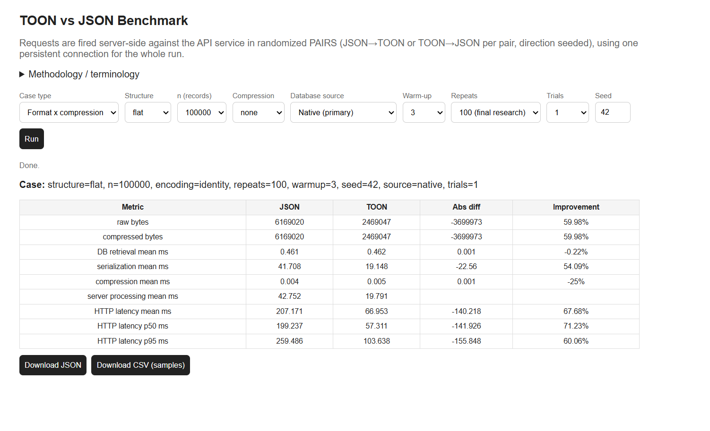

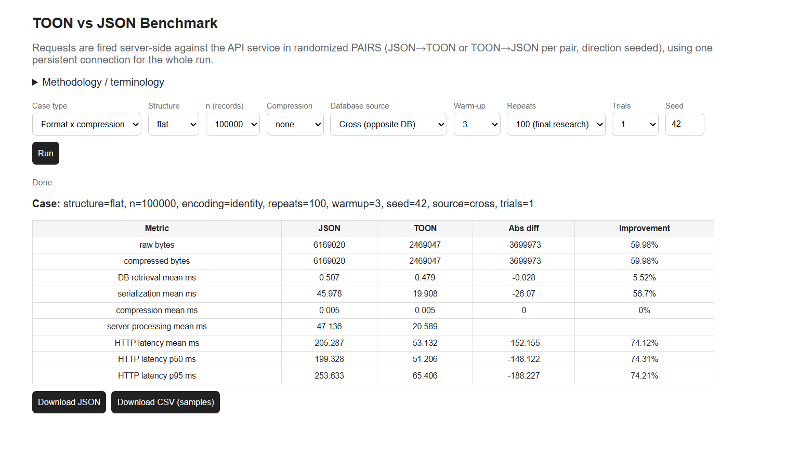


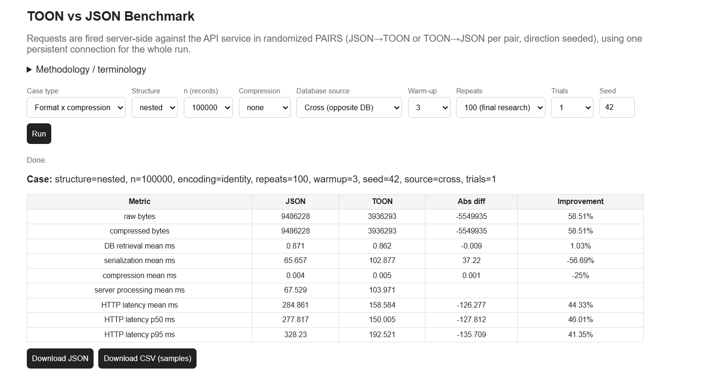

## 7.2 Brotli 5

The Brotli 5 experiments evaluate the interaction between representation
compactness and moderate compression.

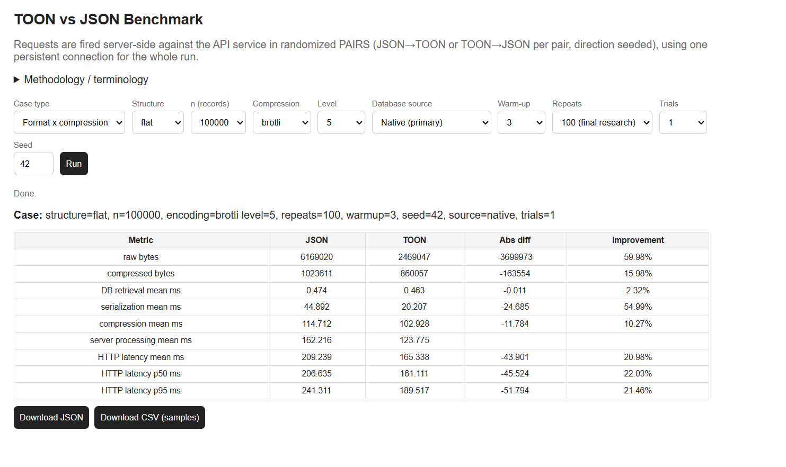

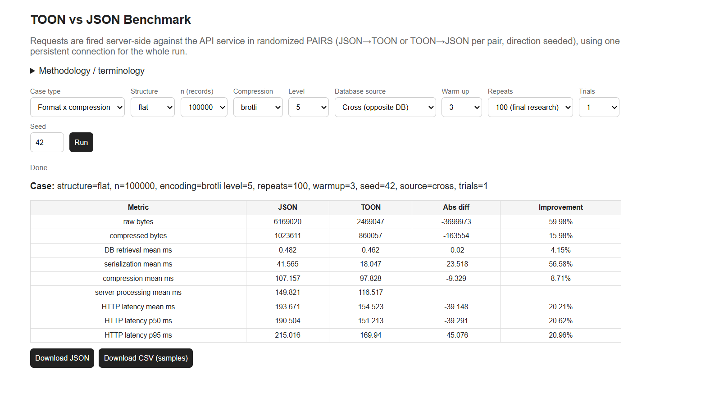


## 7.3 Brotli 9

At Brotli 9, compression CPU time becomes a more significant component
of the serving path.

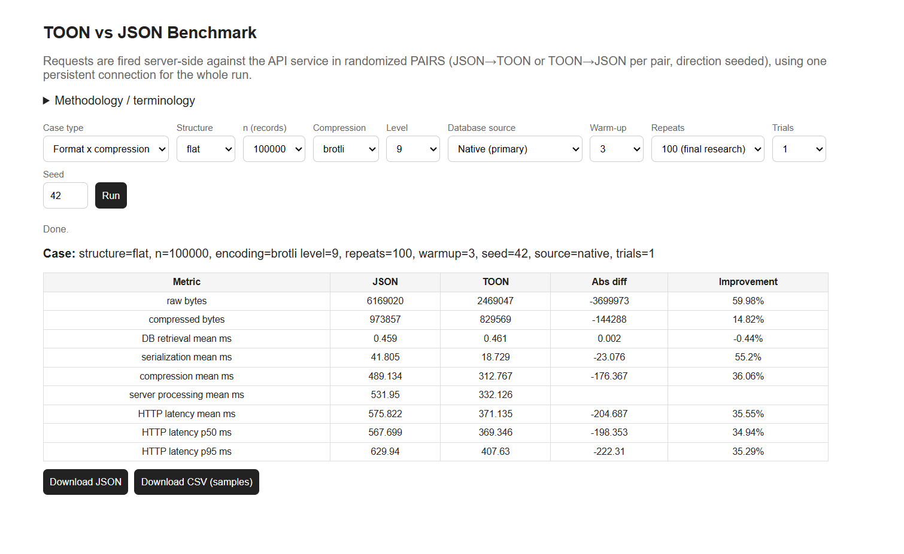

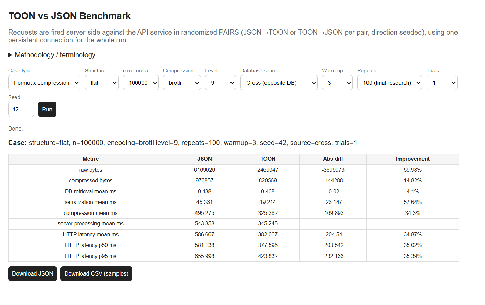


## 7.4 Brotli 11

Brotli 11 provides the strongest test of the compression-cost crossover
hypothesis.


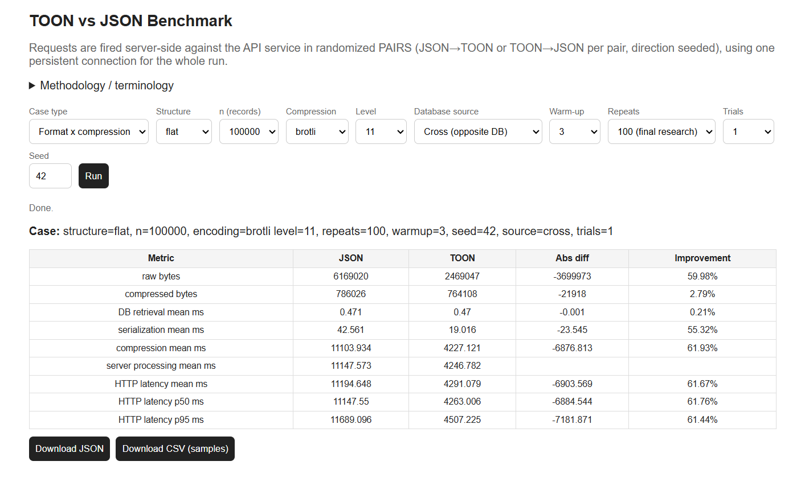


## 7.5 Cache Results

Caching is analyzed separately because response generation can be
removed or amortized from the repeated-request path.

The canonical flat cache experiment reports:

  Metric                       JSON        TOON   Reported TOON improvement
  -------------------- ------------ ----------- ---------------------------
  Cache miss latency     344.650 ms   66.003 ms                    \~80.85%
  Warm-cache mean        302.760 ms   33.650 ms                    \~88.89%

The warm-cache p95 was also substantially lower for TOON.

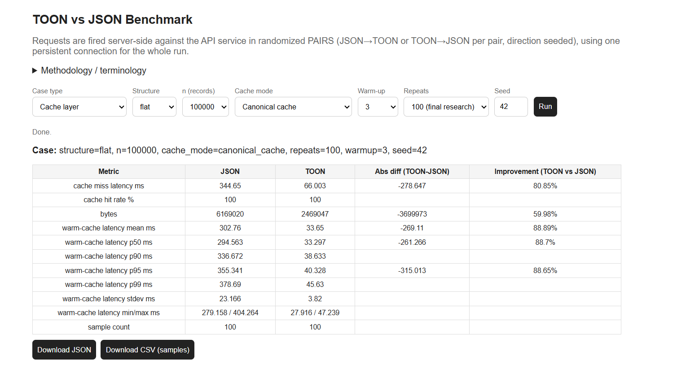

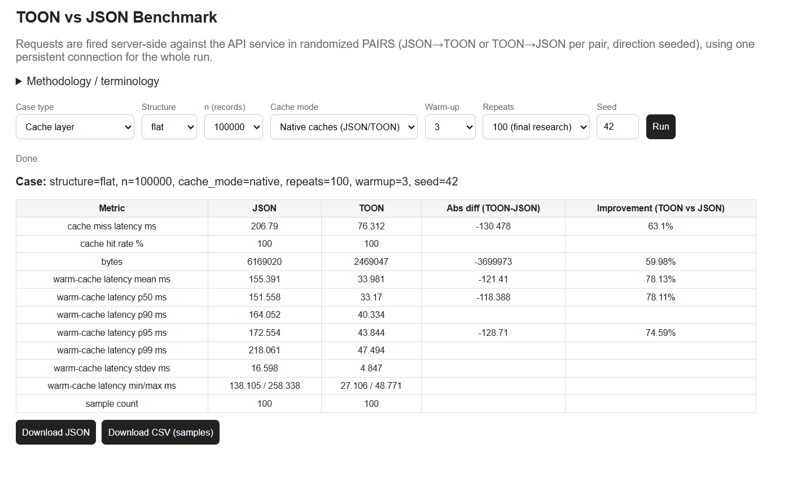

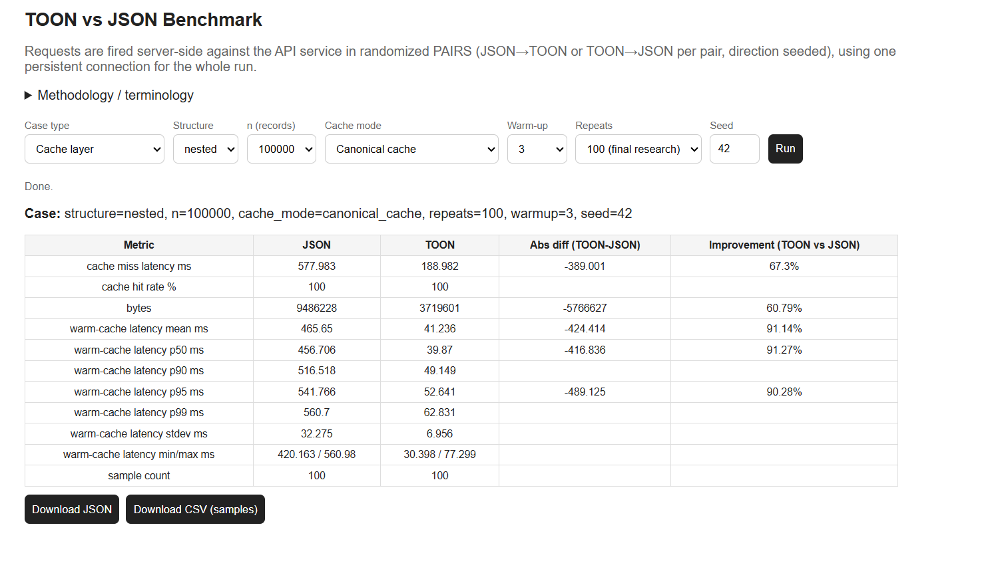

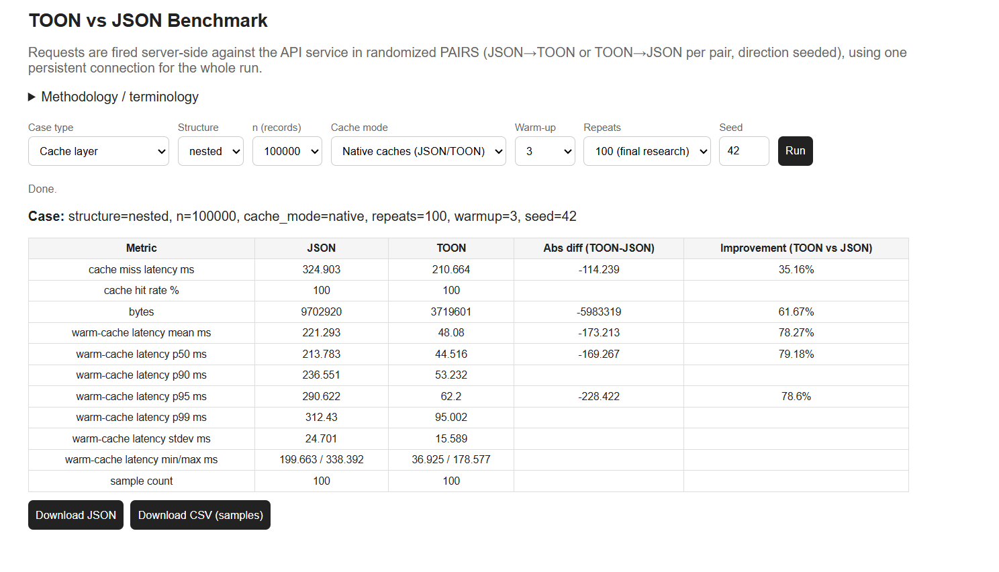

# 8. Discussion

## 8.1 Representation Efficiency vs. Implementation Efficiency

The experiments demonstrate that representation efficiency and
implementation efficiency are separate properties.

TOON can have:

``` text
smaller representation
+
slower serialization
```

and still produce lower end-to-end latency.

Conversely, a smaller representation can lose its advantage if
compression or other server-side processing becomes sufficiently
expensive.

The relevant systems-level comparison is therefore:

``` text
compact representation
        |
        +--> fewer bytes to compress
        |
        +--> fewer bytes to transmit
        |
        +--> potentially lower transport cost

versus

additional serialization work
        |
        +--> additional CPU time
```

The observed winner depends on which side dominates.

## 8.2 Nested Serialization

The nested workload exposes the current C++ TOON encoder's overhead more
strongly. Nested objects, arrays, nulls, additional structural
traversal, and more complex output construction can make TOON
serialization substantially slower than JSON.

This should be interpreted as an implementation cost of the evaluated
encoder, not evidence that every possible TOON implementation must have
the same cost.

## 8.3 Compression-Dependent Crossover

The experiments reveal a compression-dependent crossover.

At low or moderate compression, TOON's representation advantage is
directly visible, but serialization and compression costs remain
relevant.

At aggressive compression levels, compressor CPU time becomes
increasingly important. TOON's smaller input can then reduce compression
work enough to compensate for additional serialization cost.

Thus, TOON's net benefit is not a monotonic function of compression
level. The relevant systems question is how much CPU is spent producing
and compressing the representation versus how much computation and
transport work is avoided by sending fewer bytes.

## 8.4 Cache Amplification

Once response material is already available in a cache, expensive
response-generation stages can be removed or amortized. Under these
conditions, the compact representation becomes more directly visible in
serving behavior.

The observed canonical flat cache results illustrate this effect, with
approximately 80.85% lower cache-miss latency and 88.89% lower
warm-cache mean latency for TOON under the reported configuration.

# 9. Engineering Implications

The benchmark suggests that a practical optimization opportunity lies in
combining:

``` text
TOON compactness
+
optimized C++ encoder
+
existing compression pipeline
+
HTTP transport
```

The current nested workload is particularly valuable because it
identifies traversal, allocation, buffer management, and nested
object/array handling as areas where encoder optimization could reduce
overhead.

The Cross experiments additionally address adoption in legacy systems.
An application can remain JSON-oriented internally while changing the
response representation at a serving boundary:

``` text
Legacy JSON-oriented application
            |
            v
     representation layer
            |
            v
       TOON response
            |
            v
        HTTP client
```

This makes the format-level optimization potentially applicable without
requiring an entire application rewrite.

# 10. Limitations

The benchmark should be interpreted as a controlled systems benchmark
rather than a universal ranking of serialization formats.

The principal limitations are:

1.  The workloads are controlled synthetic datasets.
2.  Each final configuration uses one trial with 100 measured
    repetitions.
3.  The C++ TOON serializer is specialized for the benchmark data
    shapes.
4.  Measurements depend on deployed infrastructure and network
    conditions.
5.  Only the selected compression configurations were evaluated.
6.  Additional independent trials would provide stronger statistical
    evidence.
7.  Different schemas may produce different serialization and
    compression behavior.
8.  The experiment does not claim a universal TOON-versus-JSON
    performance ranking.

The most direct implementation limitation is the cost of nested TOON
serialization.

# 11. Reproducibility

The experiment repository contains the implementation, datasets, native
serializer, deployment configuration, dashboard, and result artifacts.

The benchmark can be reproduced by cloning the repository and running
the API implementation:

``` bash
git clone https://github.com/debugaditya/toon-benchmark.git
cd toon-benchmark
cd deploy/api
pip install -r requirements.txt
python build_data.py
python main.py
```

The native TOON extension is located under:

``` text
deploy/api/toon_cpp/
```

The final research deployment uses two services, an API and a frontend,
with the benchmark configuration documented in `render.yaml`. The
intended final research setup uses stable Pro-tier infrastructure.

# 12. Future Work

Future extensions include:

### Serializer optimization

-   Reduce allocations
-   Improve buffer management
-   Optimize nested traversal
-   Optimize array handling
-   Reduce string copying
-   Improve schema-aware encoding
-   Benchmark allocator behavior

### Workload expansion

-   Larger record counts
-   Deeper nesting
-   Wider schemas
-   Different null distributions
-   Different string lengths
-   Different array sizes
-   Realistic production datasets

### Compression expansion

-   gzip
-   zstd
-   Additional Brotli configurations
-   Compression-level sweeps

### Systems evaluation

-   Concurrent clients
-   Requests per second
-   CPU utilization
-   Memory utilization
-   Bandwidth consumption
-   Multiple persistent connections
-   Connection pooling
-   Varying network conditions

### Statistical validation

-   Multiple independent trials
-   Confidence intervals
-   Variance analysis
-   Significance testing
-   Repeated deployment runs

### Cache research

-   Different cache capacities
-   Different hit/miss distributions
-   Cache eviction policies
-   Serialized-response caching
-   Compressed-response caching
-   Multi-client cache behavior

# 13. Conclusion

This study evaluates TOON and JSON as components of an API serving
system rather than as isolated serialization formats.

For the evaluated 100,000-record workloads, TOON reduces raw
representation size by roughly 58--62%. The flat native identity
configuration demonstrates that this compactness can translate into a
substantial end-to-end HTTP improvement, while the nested workload shows
that encoder implementation cost remains important.

The compression experiments demonstrate that representation size,
serialization cost, and compression cost interact. At high Brotli
levels, TOON's smaller input can reduce compressor work sufficiently to
alter the overall performance balance. The cache experiments further
indicate that compact response representations can become particularly
advantageous once response-generation costs are removed or amortized.

The principal conclusion is therefore not that TOON universally
outperforms JSON. Rather, the benchmark shows that the performance of a
representation format emerges from the interaction of **representation
efficiency, implementation efficiency, compression, caching, and
transport**. The repository provides a reproducible experimental
structure for evaluating those interactions under controlled conditions.

------------------------------------------------------------------------

## Appendix A. Experimental Artifact Map

### Format/compression results

``` text
results/
├── plain_flat_n100000_none_native.png
├── plain_flat_n100000_none_cross.png
├── plain_flat_n100000_brotli5_native.png
├── plain_flat_n100000_brotli5_cross.png
├── plain_flat_n100000_brotli9_native.png
├── plain_flat_n100000_brotli9_cross.png
├── plain_flat_n100000_brotli11_native.png
├── plain_flat_n100000_brotli11_cross.png
├── plain_nested_n100000_none_native.png
├── plain_nested_n100000_none_cross.png
├── plain_nested_n100000_brotli5_native.png
├── plain_nested_n100000_brotli5_cross.png
├── plain_nested_n100000_brotli9_native.png
├── plain_nested_n100000_brotli9_cross.png
├── plain_nested_n100000_brotli11_native.png
└── plain_nested_n100000_brotli11_cross.png
```

### Cache results

``` text
results/
├── cache_flat_n100000_canonical.png
├── cache_flat_n100000_native.png
├── cache_nested_n100000_canonical.png
└── cache_nested_n100000_native.png
```

## Appendix B. Benchmark Timing Model

The measured serving path can be represented as:

``` text
T_HTTP =
    T_DB
  + T_serialization
  + T_compression
  + T_overhead
  + T_transport
```

The API also records UTF-8 encoding time through
`X-Utf8-Encoding-Time-Ms`. For the main result matrix, this is included
in the reported server-processing/overhead path.

------------------------------------------------------------------------

**Experiment source:** https://github.com/debugaditya/toon-benchmark
